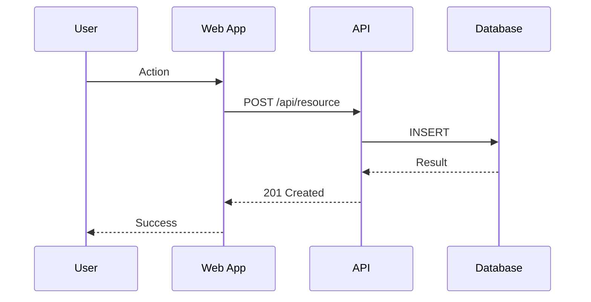

# [Feature Name] Technical Design

## Overview
[Brief technical summary of the solution approach]

**Spec Reference**: `.kiro/specs/[feature]/requirements.md`
**Last Updated**: [YYYY-MM-DD]

---

## 1. System Context (C4 Level 1)

```
┌─────────────────────────────────────────────────────────────┐
│                        [System Name]                         │
│                                                              │
│   [Actor 1] ────► [Your System] ────► [External System 1]   │
│                        │                                     │
│                        ▼                                     │
│                 [External System 2]                          │
└─────────────────────────────────────────────────────────────┘
```

### External Dependencies
| System | Purpose | Protocol | SLA |
|--------|---------|----------|-----|
| [Name] | [Purpose] | REST/gRPC/etc | [Expected SLA] |

---

## 2. Container Diagram (C4 Level 2)

```
┌────────────────────────────────────────────────────────────┐
│                     [System Boundary]                       │
│                                                             │
│  ┌─────────────┐    ┌─────────────┐    ┌─────────────┐    │
│  │   Web App   │───►│    API      │───►│  Database   │    │
│  │  (React)    │    │  (Node.js)  │    │ (PostgreSQL)│    │
│  └─────────────┘    └─────────────┘    └─────────────┘    │
│                            │                               │
│                            ▼                               │
│                     ┌─────────────┐                        │
│                     │   Queue     │                        │
│                     │   (SQS)     │                        │
│                     └─────────────┘                        │
└────────────────────────────────────────────────────────────┘
```

### Technology Stack
| Component | Technology | Justification |
|-----------|------------|---------------|
| Frontend | [Tech] | [Why] |
| Backend | [Tech] | [Why] |
| Database | [Tech] | [Why] |
| Cache | [Tech] | [Why] |

---

## 3. Component Design (C4 Level 3)

### 3.1 [Component Name]
**Responsibility**: [Single-sentence purpose]

**Location**: `src/[path]/`

**Public Interface**:
```typescript
interface ComponentNameAPI {
  methodOne(input: InputType): Promise<OutputType>;
  methodTwo(id: string): Promise<Entity | null>;
}
```

**Dependencies**:
- [Port/Interface it requires]

---

## 4. Data Models

### 4.1 [Entity Name]
```typescript
interface EntityName {
  id: string;           // UUID v4
  createdAt: Date;      // ISO 8601
  updatedAt: Date;      // ISO 8601
  // Domain fields
  field1: string;       // [constraints/validation]
  field2: number;       // [constraints/validation]
  status: EntityStatus; // Enum: DRAFT | ACTIVE | ARCHIVED
}
```

### 4.2 Database Schema
```sql
CREATE TABLE entity_name (
  id UUID PRIMARY KEY DEFAULT gen_random_uuid(),
  created_at TIMESTAMPTZ NOT NULL DEFAULT NOW(),
  updated_at TIMESTAMPTZ NOT NULL DEFAULT NOW(),
  field1 VARCHAR(255) NOT NULL,
  field2 INTEGER CHECK (field2 >= 0),
  status VARCHAR(20) NOT NULL DEFAULT 'DRAFT'
);

CREATE INDEX idx_entity_status ON entity_name(status);
```

---

## 5. API Design

### 5.1 REST Endpoints
```yaml
POST /api/v1/[resource]:
  description: Create new resource
  request:
    body:
      field1: string (required)
      field2: number (optional)
  response:
    201: { id: string, ...resource }
    400: { error: string, code: "VALIDATION_ERROR" }

GET /api/v1/[resource]/{id}:
  description: Get resource by ID
  response:
    200: { ...resource }
    404: { error: string, code: "NOT_FOUND" }
```

### 5.2 Event Contracts (if applicable)
```typescript
interface ResourceCreatedEvent {
  type: 'RESOURCE_CREATED';
  payload: {
    id: string;
    timestamp: string;
    data: ResourceData;
  };
}
```

---

## 6. Sequence Diagrams

### 6.1 [Flow Name]


---

## 7. Security Considerations

### Authentication & Authorization
- [Auth mechanism]
- [Permission model]

### Data Protection
- [Encryption at rest/transit]
- [PII handling]

### Input Validation
- [Validation strategy]
- [Sanitization approach]

---

## 8. Performance Considerations

### Targets
| Metric | Target | Measurement |
|--------|--------|-------------|
| Response Time (p95) | < 200ms | [How measured] |
| Throughput | [X] req/sec | [How measured] |

### Optimization Strategies
- [Caching strategy]
- [Query optimization]
- [Connection pooling]

---

## 9. Failure Modes & Recovery

| Failure | Impact | Detection | Recovery |
|---------|--------|-----------|----------|
| [Database down] | [Impact] | [Health check] | [Failover] |
| [External API timeout] | [Impact] | [Timeout alert] | [Circuit breaker] |

### Rollback Procedure
1. [Step 1]
2. [Step 2]

---

## 10. Observability

### Logging
- Structured JSON logs
- Correlation ID propagation
- Log levels: ERROR, WARN, INFO, DEBUG

### Metrics
- `[metric_name]`: [description]
- `[metric_name]`: [description]

### Alerts
| Alert | Condition | Severity | Action |
|-------|-----------|----------|--------|
| [Name] | [Threshold] | P1/P2/P3 | [Runbook] |

---

## 11. Migration Plan (if applicable)

### Data Migration
- [Migration strategy]
- [Rollback plan]

### Feature Flags
- `[flag_name]`: [purpose]

---

## Related ADRs
- [ADR-XXX: Decision Title](./decisions/XXX-title.md)

## Open Design Questions
- [ ] [Unresolved question]
